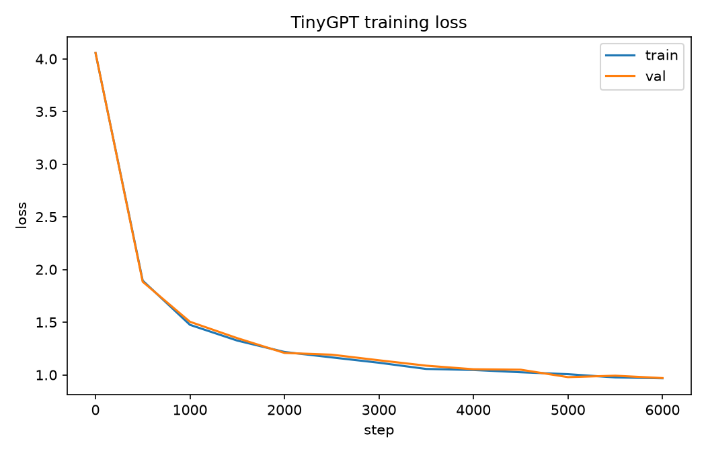

# tiny-gpt-scratch

A small, multi-layer character-level GPT built on `torch.nn`/autograd:
LayerNorm, dropout, residual connections, AdamW — the way you'd actually
train a small transformer.

A sibling project, tiny-gpt-numpy, implements the same idea with every
tensor op (including backprop through attention) written out by hand in
NumPy, no autograd — useful if you want to see the math with no framework
hiding it.

## Setup

```bash
python3 -m venv .venv
source .venv/bin/activate
pip install -r requirements.txt
```

Requires a plain-text training corpus (any UTF-8 text) at `data/train.txt`,
or pass `--data path/to/your/corpus.txt`. The vocabulary is just the set of
characters that appear in that file.

## Data

[TinyStories](https://huggingface.co/datasets/roneneldan/TinyStories) is a
good first dataset to try this on: short, simple stories with a small
vocabulary, generated specifically for training small language models, and
large enough to show the model actually learning. Download
`TinyStoriesV2-GPT4-train.txt` from that page and point `--data` at it (or
save it as `data/train.txt`):

```bash
python -m torch_gpt.train --data path/to/TinyStoriesV2-GPT4-train.txt
```

Any other plain-text corpus works the same way — swap in your own once
you've got a feel for the model on TinyStories.

## Usage

```bash
python -m torch_gpt.train --max-steps 6000
python -m torch_gpt.sample --checkpoint checkpoints/torch_gpt.pt --prompt "Once upon a time"
```

Run `--help` on either script for the full list of hyperparameters (block
size, embedding dim, heads, layers, learning rate, etc.) — nothing is
hardcoded. `sample.py` only loads a checkpoint and generates; it never
retrains.

## Evaluation

`train.py` logs train/val loss on every eval step to `checkpoints/history.json`.
`eval.py` turns that into a plot and prints a few sample generations from the
checkpoint:

```bash
python -m torch_gpt.eval --checkpoint checkpoints/torch_gpt.pt
```

The plot below is from the default config (6 layers, 256-dim, 6000 steps,
4.8M parameters) trained on the TinyStories validation split — train/val
loss tracking together with no overfitting, down to a val loss of 0.97:



```
--- Prompt: 'Once upon a time' ---
Once upon a time, there was a little girl named Lily. She wants to play in
the strong ship. She had so much fun. She looked at the bird and not be
scarefus. She saw a girl named Lily. Max was so happy and had a very

--- Prompt: 'The little robot' ---
The little robot went with the fish.
The ball was sad. The little girl was very happy and the park. The hug and
the boy were scared. They had a big, fun day and his breather. It climbed
up and played in the sky and w
```

## Project layout

```
common/       shared character tokenizer + train/val data loading
torch_gpt/    model.py (nn.Module), train.py, sample.py, eval.py
tests/        shape, tiny-batch-overfit, and eval-plotting tests
assets/       loss_curve.png used in this README
checkpoints/  trained models land here (gitignored — regenerate by training)
```

## Tests

```bash
pytest
```

## License

MIT — see [LICENSE](LICENSE).
